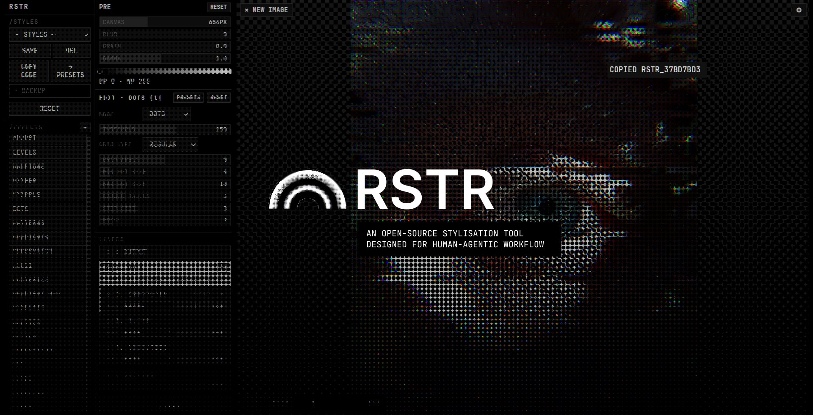

# RSTR

A local, brutalist, grayscale, shader-based image-effects tool with two heads sharing one shader pipeline and one preset ("style code") format. Formerly named **SHDR**.

- **Editor** (`index.html`) — load an image, browse effects, stack them into a mix with per-layer opacity/blend/mask, export a PNG/WebP/JPEG or a style code.
- **Engine** (`engine/rstr.js`) — a Node CLI that applies a saved style to a whole folder of images in batch, using headless system Chrome.

Shader code lives once, in `src/`. Both heads load the same files — the engine never re-implements an effect. The `src/*.js` files are **classic scripts** on a global `window.RSTR` namespace (no ES modules, no bundler), so the editor opens by double-click over `file://` and also works when hosted on any static host. The repo deploys as a static site for the editor (see `.vercelignore`); the engine is a local Node CLI, not part of that deploy.

## Repo layout
```
index.html            editor entry — double-click to open
src/
  gl.js                WebGL2 helpers (compile, fullscreen quad, textures, ping-pong FBOs)
  assets.js            bundled image assets (pattern tiles, displacement map) as data URIs -> RSTR.assets
  effects.js           EFFECTS registry: id -> { name, params, built-in presets, and a frag shader OR a cpu stage }
  pipeline.js          OUTPUT (crop/scale) + runs the ordered mix (shader/CPU passes, per-layer opacity/blend/mask) + encodes to format@quality
  preset.js            style (de)serialize + deterministic id + legacy-effect migration + style-library & per-effect-preset stores (localStorage)
  ui.js                the entire editor UI: three-column layout, scrub bars, drag-to-reorder, blend-mode popover
engine/
  render.html          headless page: loads src/*, exposes window.RSTR.render(dataURL, preset)
  rstr.js              CLI: puppeteer-core + installed Chrome, batch-applies a style to a folder
  package.json
presets/                saved style codes (*.json)
test-assets/             sample PNGs for self-testing (synthesized, see scripts/gen-test-assets.mjs)
scripts/
  gen-test-assets.mjs    regenerates test-assets/ (no dependencies, no network)
LICENSE                 GPL-3.0
```

The UI is pure-grayscale brutalism (monospace, square corners, 1px hairlines, no hue — active/selected is inverted, not colored). The only colors on screen are the loaded image and any `color`-type effect params.

## 1. Editor

**Launch: double-click `index.html`.** It opens directly in your browser over `file://` — no server, no build step. (The same folder is also directly hostable as a static site.)

### Layout — three columns
- **Nav** (leftmost) — `RSTR` header → `/Styles` (library dropdown, `Save`/`Del`, `Copy code`, `→ Presets`, a collapsed `Backup` disclosure with `Export all`/`Import`, `Reset`) → `/Effects`, the full effect catalog and the **only scrolling region** in the app. The list is user-organisable: drag-to-reorder, collapsible user-created groups.
- **Workbench** (middle) — the **PRE module** (always expanded) → the EDIT/NEW/OUTPUT settings panel (its own RESET + a presets modal trigger) → `ADD TO MIX` → the LAYERS/MIX stack, `◇ OUTPUT` pinned top and `◇ ORIGINAL` pinned bottom → a pinned footer with `EXPORT`.
- **Canvas** (rightmost) — the image, with overlays: `✕ New image` top-left, `⚙` settings gear top-right (swaps `/Effects` in the nav column for an enable/disable checklist, same order/groups), zoom controls bottom-left.

**`/Styles`** — the named Style Library (whole styles = layers + output, stored in `localStorage`): a dropdown of saved styles, `Save`/`Del`, `Copy code` (style JSON to the clipboard), `→ Presets` (writes an engine-ready `presets/<name>.json` via the File System Access API), a collapsed `Backup` disclosure (`Export all`/`Import`, backing up the whole library as one JSON), and `Reset`. There is no "Paste code" button — a global **Ctrl+V**, anywhere on the page, pastes a style (a `rstr_` id or full JSON) or an image through the same code path.

**Range controls are scrub bars** (`makeScrub`) — a full-width bar per param (label left, value right, fill = position): click-or-drag anywhere = absolute set, wheel = ±1 step, dblclick = reset to default. **Click the value to type an exact number** (clamped/rounded to the param's own precision, Esc cancels). **Shift** (drag or wheel) quantizes to a 10× step. A few scrubs (e.g. PRE's Canvas width) have opt-in magnetic snapping to round numbers.

**PRE module** — a live working buffer rendered at the end of the committed mix: **Canvas** (an explicit working-buffer WIDTH in px — not a percentage — defaulting to the source's own native width; writes `output.scale = {mode:'width', size}` directly), **Blur / Grain / Gamma** scrubs, and a black-point/white-point levels track. `ADD TO MIX` bakes PRE into the mix as its own `Preprocess` layer glued under the effect being added, then resets.

**Edit panel** — edits ONE target, shown in its header: `NEW · <Effect>` (a freshly picked effect, previewed on top of the committed mix — `ADD TO MIX` commits it as a layer and switches straight to editing it), `EDIT · <Effect> [n]` (an existing mix layer, edited in place, live), or `EDIT · OUTPUT`. Each effect ships 2-3 built-in starter presets plus your own saved ones (per-effect, `localStorage`).

**LAYERS / MIX stack** — top to bottom:
- **`◇ OUTPUT`** (pinned top, not reorderable/removable) — crop (`ratio` + a Figma-style 3×3 align anchor), scale (`none` / `longest-side` / `width` / `exact W×H`), format (`png`/`webp`/`jpeg` + quality), and a live `SRC→OUT` dimensions readout. Toggle = passthrough.
- **Effect layers** — drag-to-reorder (the whole row is the drag handle; pressing an interactive control like the opacity scrub or blend picker suppresses the drag for that press). Each row is two lines: the effect row (eye toggle to enable/disable, click to EDIT) and a controls row with a **MASK** toggle (+`INV`), a **blend-mode** picker, and an **Opacity** scrub (0–100%).
- **`◇ ORIGINAL`** (pinned bottom, not reorderable/removable, no blend control) — a base plate: the finished stack composited Porter-Duff source-over the raw source × opacity. **Defaults OFF.**

**Blend modes** — Figma's catalog minus `PASS_THROUGH` (Darken/Multiply/Plus darker/Color burn · Lighten/Screen/Plus lighter/Color dodge · Overlay/Soft light/Hard light · Difference/Exclusion · Hue/Saturation/Color/Luminosity), plus RSTR's own **Alpha**/**Alpha invert** (the layer's grayscale output becomes an alpha mask on its backdrop). It's a custom hover-preview popover, not a native `<select>`.

**MASK** — a flagged row is not composited; its luminance instead multiplies the blend opacity of the next enabled, non-mask layer (`INV` inverts). Only reaches the adjacent next layer.

### Using it
1. Drop an image onto the canvas (or click it to pick a file). `✕ New image` (top-left) returns to the drop zone; drag-drop a new image over the canvas at any time also swaps it.
2. Click an effect in `/Effects` to preview it (`NEW` mode); tune its scrubs or pick a per-effect preset.
3. `ADD TO MIX` to commit it as a layer; repeat to stack. Click a mix layer to re-edit it in place; drag rows to reorder; use the eye/MASK/blend/opacity controls per row.
4. Click `◇ OUTPUT` to set crop/scale/format/quality. Click `◇ ORIGINAL` to composite the raw source back under the finished stack.
5. `EXPORT` renders the committed mix at the OUTPUT resolution and downloads `<name>-rstr.<ext>` (extension follows the format).
6. **Styles**: `Save` stores the current style in your local library; the dropdown reloads one (replaces the mix + output). `Copy code` puts the style JSON on the clipboard; `→ Presets` writes it to `presets/` for the engine; **Ctrl+V** pastes a style JSON/id or an image from anywhere on the page.

### Canvas viewport
Display-only — zoom/pan never re-render the pipeline, and export/the engine always output the full processing-resolution image regardless of on-screen zoom. Fit-to-view and centered on load (never upscaled past 100% for a genuinely new image). Controls (bottom-left): a zoom slider + `%` readout, `Fit`/`100%` buttons, **Ctrl+wheel** to zoom toward the cursor, **middle-drag** to pan. `image-rendering: pixelated`. A working-buffer resize from dragging PRE's Canvas scrub on the same image snaps the view to 100% zoom instead of compensating, so the effect's marks hold their true pixel size as the picture scales around them.

## Effects (20)

`adjust, levels` · `halftone, dither, stipple, dots, patterns, gradients, crosshatch, ascii` · `posterize, gradientmap` · `pixelate, scatter, glitch` · `aberration, crt, bevel, cellular, bloom`.

Several of these are merged families behind a `mode` param rather than separate catalog entries: `posterize` also covers the old `threshold`/`quantize`; `halftone` also covers the old `riso` (misregistered, overprinted ink-separation screens); `dots` covers the old `dots`/`edge`/`dotpattern`; `gradientmap` absorbed the old `recolor` outright (a GPU gradient map with posterize/noise/repetitions, not just a CPU LUT). `adjust` also covers the old standalone `hue`, `sharpen`, and `invert`. `blur` lives inside the PRE module, not as a mix effect. Effects removed outright with no replacement: `displace`, `distort`, `duotone`, `warp`. Old style codes referencing a merged/renamed effect are auto-migrated to the new one (see **Style code format** below, `LEGACY_EFFECTS`); codes referencing a fully-removed effect just have that layer dropped with a console warning instead of crashing.

## 2. Engine

```
cd engine
npm install
node rstr.js --preset ../presets/my-retro.json --in ../test-assets --out ../out
```

```
Usage: node rstr.js --preset <file|id> --in <dir> --out <dir> [--suffix -rstr]
  --preset   path to a style .json, or a bare id (e.g. rstr_ab12cd34) resolved against presets/
  --in       folder of input images (.png/.jpg/.jpeg/.webp)
  --out      folder to write output PNGs to (created if missing)
  --suffix   filename suffix before the extension (default: -rstr)
```

It launches the Chrome at `C:\Program Files\Google\Chrome\Application\chrome.exe` (override with the `CHROME_PATH` env var) via `puppeteer-core` — no Chromium download. It loads `engine/render.html` once, then for each image in `--in`: reads it, converts to a data URL, calls `window.RSTR.render(dataURL, preset)` in-page (the same `src/pipeline.js` the editor uses — crop → resize → effects → encode), and writes the result to `--out`. **The output file extension follows the style's `output.format`** (`png` / `webp` / `jpg`), so a webp style yields `.webp` files.

The only launch flags are the software-WebGL ones headless Chrome needs to render off-screen (`--use-gl=angle --use-angle=swiftshader --enable-unsafe-swiftshader --no-sandbox`), verified against the installed Chrome. Because the shared core is classic scripts, no file-access/CORS overrides are required.

## Style code format

```json
{
  "id": "rstr_6dd26753",
  "name": "riso-pink-blue",
  "v": 1,
  "stack": [
    {
      "effect": "halftone",
      "enabled": true,
      "params": {
        "mode": 1,
        "inkCount": 2,
        "ink1": "#ff48b0",
        "ink2": "#0078bf",
        "ink3": "#ffe800",
        "paper": "#f2ede1",
        "cellSize": 7,
        "registration": 2.5,
        "inkTexture": 0.35,
        "seedOffset": 0
      },
      "opacity": 0.9,
      "blend": "multiply"
    }
  ],
  "output": {
    "crop": { "ratio": "original", "align": "C" },
    "scale": { "mode": "none", "size": null, "width": null, "height": null },
    "format": "png",
    "quality": 0.92
  }
}
```

`id` is a short deterministic hash of `{v, stack, output[, pre][, source]}` — the same recipe always produces the same id. Hand another agent either the id (if the style already lives in `presets/`) or the full JSON. The `output` block is optional; when absent it defaults to `{crop:{ratio:"original",align:"C"}, scale:{mode:"none",…}, format:"png", quality:0.92}`. Legacy `{crop:"1:1", size:1080}` styles are auto-migrated on load (→ `crop.ratio` + `scale.mode:"fit"`). `presets/` ships example styles including `my-retro.json` (effects only, default output) and `webp-1080.json` (1:1 / 1080 / webp).

A stack entry may also carry `"opacity"` (0–1, serialized only when < 1), `"blend"` (one of RSTR's blend-mode ids, serialized only when ≠ `"normal"`), and `"mask"` (an object `{invert}`, serialized only when present) — all three are per-layer compositing controls, not effect params, and each is omitted at its default so a pre-opacity/blend/mask style code stays byte-identical. A top-level `"source"` block (`{enabled, opacity}`) represents the pinned `◇ ORIGINAL` base plate and likewise serializes only when it differs from its `{enabled:false, opacity:1}` default. A stack entry may also reference the internal `preprocess` effect (how the editor's PRE block is committed); legacy codes with a top-level `"pre"` block still load, converted to a leading `preprocess` layer.

Layers referencing an effect that was **merged into another one** (`edge`, `dotpattern`, `threshold`, `quantize`, `riso`, `recolor`, `invert`) are migrated via `LEGACY_EFFECTS` in `src/preset.js` before the mix is used — a migrated style gets a new `rstr_` id. Layers referencing an effect that was **removed outright** (`displace`, `distort`, `blur`, `hue`, `sharpen`, `duotone`, `warp` — hue and sharpen now live inside `adjust`, blur lives in PRE) are dropped with a console warning instead of crashing.

## Adding a new effect

Add one entry to `EFFECTS` in `src/effects.js` (id, name, params schema, built-in presets, and **either** a `frag` fragment shader **or** a `cpu(rgba, w, h, params) -> rgba` CPU stage — mutually exclusive). Param types are `range` / `select` / `color` / `text` (a free-form string, cpu-only) / `stops` (an array of `{pos,color}`, uploaded as GPU uniforms too). A param can carry `showIf: { key, in: [...] }` to hide it in the UI when a sibling select param doesn't match (UI-only — the pipeline still uploads every param as a uniform regardless). The editor UI (the `/Effects` list + settings checklist), per-effect presets, and the pipeline all read this registry — nothing else changes. A `cpu` effect is run by the pipeline via readback → JS → re-upload as a texture, so it works identically in the editor and the engine (e.g. the Floyd–Steinberg dither).

**Future (out of scope for now):** vector/SVG output, animation (slide/stack) — they need a multi-frame runtime the single-pass pipeline doesn't have yet.

## Self-test

`scripts/gen-test-assets.mjs` synthesizes `test-assets/gradient.png`, `shapes.png`, `radial.png` with a hand-rolled PNG encoder (no native deps, no network). Regenerate with `node scripts/gen-test-assets.mjs`.

To confirm the engine actually applies shaders (not a passthrough), run it over `test-assets/` and compare bytes/sizes, or decode both images to pixels (e.g. via a `<canvas>` in any browser) and diff. During development this was verified for the example styles and individual effects — every case showed 90-100% of pixels changed, average per-channel differences in the tens-to-hundreds (out of 255), never zero. The `webp-1080` style was confirmed to produce 1080×1080 `.webp` output in both the editor export and the engine.

## Contributing

Contributions are welcome. The whole app is classic scripts on `window.RSTR` — no build, no framework, no bundler. To hack on the editor, double-click `index.html` and reload after edits. Most changes are one entry in the `EFFECTS` registry (see **Adding a new effect** above). Open an issue to discuss larger changes, then send a PR — every PR gets an automatic Vercel preview deploy.

## License

RSTR is free software licensed under the [GNU General Public License v3.0](LICENSE). You may use, study, share, and modify it; any distributed derivative must also be released under the GPL-3.0. It comes with no warranty.

Copyright © 2026 Kirill Peskov
